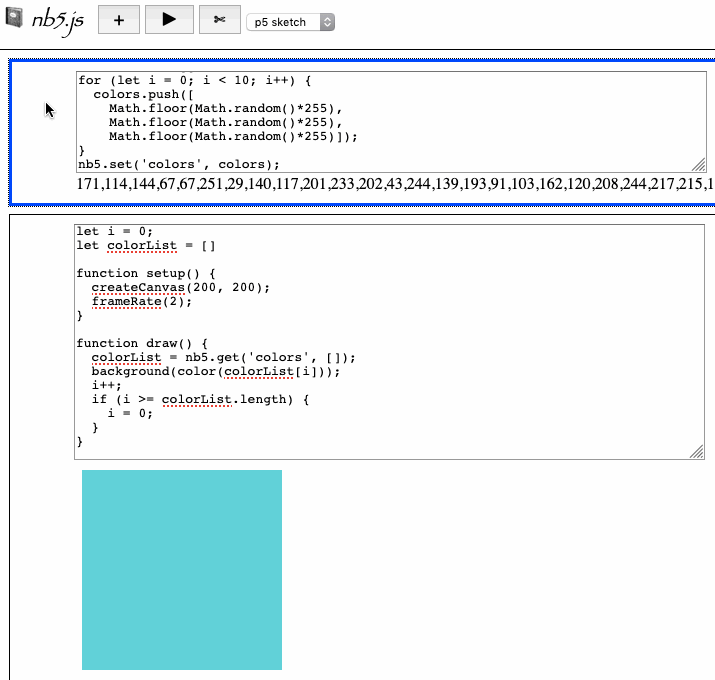

# nb5.js: a notebook for p5js sketches (proof of concept)

by [Allison Parrish](https://www.decontextualize.com/)

Made for the "Landscape of Creative Technology" track at the 2019 p5.js
Contributor's Conference.

## Rationale

I like notebook interfaces. I do most of my work in [Jupyter
Notebook](https://jupyter.org/). Notebooks have a handful of properties that
facilitate the kind of work that I do:

* Notebooks are composed of "cells," which are a level of abstraction and
  reusability that cuts across the level of line and function;
* Cells can be executed out-of-order, making it possible to develop portions of
  your code independently (without having to re-run everything from
  scratch);
* Cells can contain code *or* text, making it easy to interject explanations,
  documentation and signposts in your code;
* Notebooks can be shared and exported into different formats, producing not
  "program" but a document of a process.

I use Jupyter Notebook extensively both for development, writing
tutorials, and distributing source code for tutorials and workshops. But while
notebook software like Jupyter, [Observable](https://beta.observablehq.com/),
and [Iodide](https://alpha.iodide.io/) support JavaScript as a programming
language, none of them have built-in, idiomatic support for p5.js, nor are they are not necessarily good matches for p5.js as a tool or as a community.

My criteria for a good p5.js notebook:

* It should work in [Global
  Mode](https://github.com/processing/p5.js/wiki/Global-and-instance-mode), not
  just instance mode. Instance mode is awkward and unfamiliar to
  beginners.
* JavaScript code and sketch code should be visible, not hidden (as it often is
  in Observable and in Iodide's Report mode).
* It should run p5.js sketches live in the browser.
* It should be as purely browser-based as possible, ideally with the ability to
  run locally.
* Sketches in the notebook should be read and modify the global JavaScript
  state, and also able to communicate with each other.
* It should be freely available and open source.

The primary purpose of of a p5.js notebook should be *writing and experimenting
with p5.js code*, not using p5.js as part of a development process for some
other language or framework.

There are a number of other attempts to make notebook-like interfaces for
p5.js, or to adapt p5.js to an existing notebook interface. Here are the ones
I'm aware of.

* [Discussions on using p5.js in Observable notebook](https://discourse.processing.org/t/include-p5-js-in-observable-notebook/458/2) on the Processing forum
* [p5.js in the Jupyter Notebook using the Jupyter Widgets](https://github.com/jtpio/ipyp5)
* [Jupyter Notebook magic for Global Mode](https://jupyter.brynmawr.edu/services/public/dblank/jupyter.cs/Testing%20P5%20in%20Javascript.ipynb)
* [Processing.js in an IPython Notebook](https://jarrodmcclean.com/processing-js-in-an-ipython-notebook/)

But none of these attempts meet all of the criteria I outlined above. So I
decided to make my own! Hence this GitHub repository.

## nb5.js proof of concept

I call it `nb5.js` and the code in here is a proof of concept. The primary
structural innovation of my approach is that there are separate cell types for
JavaScript code and for p5.js sketches. JavaScript code is executed with
`eval()`, while p5.js sketches are loaded in `<iframe>` elements with data
URLs. There's a global object, `nb5`, that facilitates sharing data between the
JavaScript context of the parent frame and the sketches running in child
frames.

What it does so far:

* Create, run and delete text, JavaScript, and p5.js sketch cells
* Call `nb5.set('x', val)` to make `val` available to parent frame JavaScript
  and sketches; `nb5.get('x', defaultVal)` returns the current value for symbol
  `x`, or `defaultVal` if it hasn't been set (or if the sketch hasn't received
  the global state yet after running)

Missing functionality (pretty much everything):

* Save, load, export notebooks
* Reorder, cut, copy, paste cells
* Markdown rendering
* etc.

To try it out:

* Clone this repository somewhere
* Start a local web server on port 8000 (try running `python -m http.server`)
* Open `http://localhost:8000/` in the browser
* Have fun!

This is just a proof of concept, intended to help me clarify my ideas and
figure out what is possible. It's also a mess. Thank you for coping with it!
n its current state!

## License

Copyright 2019 Allison Parrish

Permission is hereby granted, free of charge, to any person obtaining a copy of
this software and associated documentation files (the "Software"), to deal in
the Software without restriction, including without limitation the rights to
use, copy, modify, merge, publish, distribute, sublicense, and/or sell copies
of the Software, and to permit persons to whom the Software is furnished to do
so, subject to the following conditions:

The above copyright notice and this permission notice shall be included in all
copies or substantial portions of the Software.

THE SOFTWARE IS PROVIDED "AS IS", WITHOUT WARRANTY OF ANY KIND, EXPRESS OR
IMPLIED, INCLUDING BUT NOT LIMITED TO THE WARRANTIES OF MERCHANTABILITY,
FITNESS FOR A PARTICULAR PURPOSE AND NONINFRINGEMENT. IN NO EVENT SHALL THE
AUTHORS OR COPYRIGHT HOLDERS BE LIABLE FOR ANY CLAIM, DAMAGES OR OTHER
LIABILITY, WHETHER IN AN ACTION OF CONTRACT, TORT OR OTHERWISE, ARISING FROM,
OUT OF OR IN CONNECTION WITH THE SOFTWARE OR THE USE OR OTHER DEALINGS IN THE
SOFTWARE.

